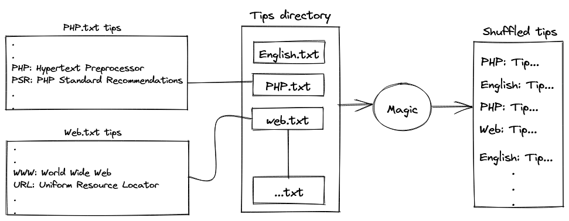
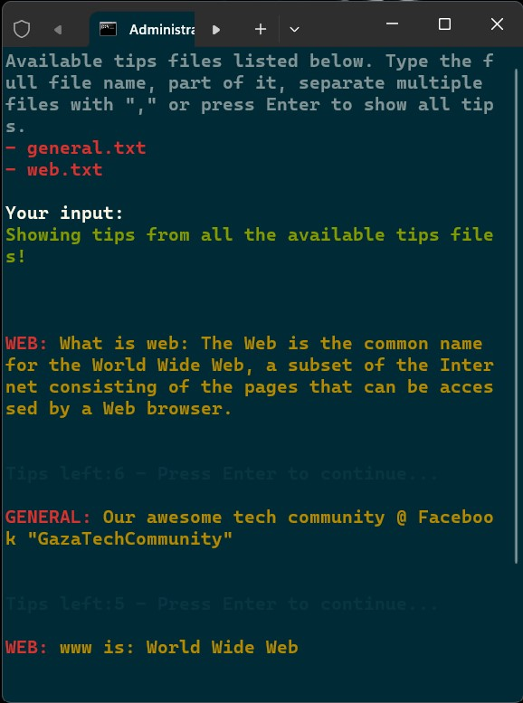
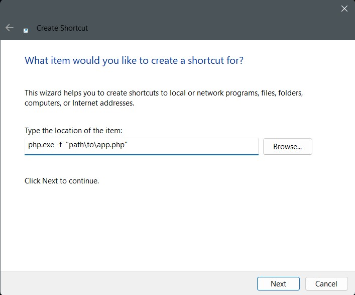
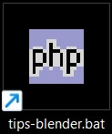

# What is

This is a simple PHP command line app to read and show random tips from a set of text files found inside the `tips` directory, line by line, by pressing `Enter` key!



Because I'm learning many things at the same time, I need to show on a separated screen the most important information as simple notes or "tips" to be randomly shown to me while watching a movie, YouTube video, or playing video games.

# Installation
- Make sure you have installed PHP. Inside the CLI type: `php -v`, shows something like:
```php
PHP 8.1.10 (cli) (built: Aug 30 2022 18:05:49) (ZTS Visual C++ 2019 x64)
Copyright (c) The PHP Group
Zend Engine v4.1.10, Copyright (c) Zend Technologies
```
- Create a folder: `mkdir tips-blender`
- Get inside the created directory: `cd tips-blender`
- Clone the current GIT repository: `git clone git@github.com:MohammadAlBanna/tips-blender.git .`
- Run the app: `php app.php`
- The app will list the tips files inside the `tips` directory, add your own tips text files as you need.
- You can type part of the file name, multiple file names, or nothing (shows all tips), the app shuffles the tips and start showing you tip by tip by pressing `Enter`.
- **Live preview:** 
  - 

# Info
- **For Windows users**: You can open the app as an executable application:
  - Create a shortcut with the path `php.exe -f path\to\app.php`:
  
  
  - Save it as `tips-blender.bat`, and pin the shortcut into the taskbar or start menu: 
- The app supports only `.txt` files.
- Enter your notes line by line as shown in the samples inside `tips` directory.
- Empty lines will be ignored inside the CLI.

# To Do
- Analyze the current tip:
  - **Memory Recall**: Hide part of the tip and show it after pressing Enter.
  - If it has an image or executable app, open/execute it!
- Create **Unit Testing** for the functions.
- Add more controls/flags to activate/deactivate some features.
